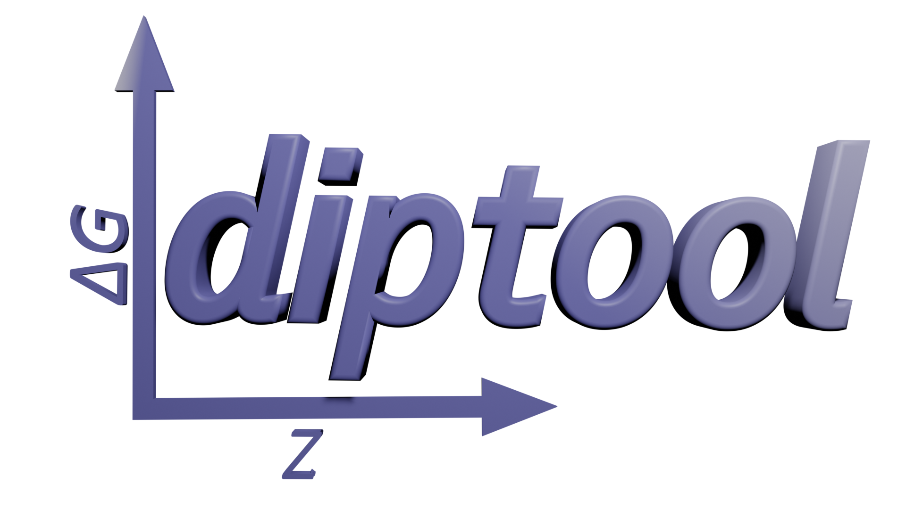
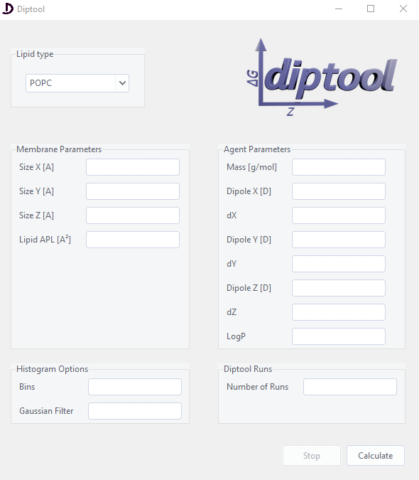

# Diptool

[](https://doi.org/10.5281/zenodo.10641713)
[](https://doi.org/10.3390/ma14216455)

<div align="right">
  
</div>


 Diptool is a screening tool for a rapid determination of the antimicrobial agent affinity to various types of homogenous lipid membranes delivering particle trajectory visualization and free energy analysis. It's significantly faster than classical methods, reaching a one million-fold compared to the MD approach. 
 It provides a graphical user interface (GUI) with features for visualizing energy plots, calculating statistics, and running simulations with customizable parameters.
 
 ### New Features in Version 2.14:
- **Support for heterogenous membranes:** Diptool now includes enhanced functionality to analyze simulations involving membranes composed of three distinct lipid types.
- **Improved Run Management:** command-line execution has been added to the Python script `diptool_arg.py`.

 
## Features

- **Visualize Energy Plots**: Diptool allows you to generate energy plots based on membrane and agent features. You can analyze changes in energy with respect to molecular displacement.
  
- **Customizable Parameters**: You can set various parameters for the membrane and agent properties, such as size, dipole, mass, and more.

- **Histogram Options**: Diptool enables you to adjust histogram settings or apply plot filtering, for more accurate energy analysis.

- **Simulation Runs**: The application supports running multiple simulation runs with user-defined parameters to gather comprehensive data.

- **User-Friendly GUI**: The GUI is designed with the user in mind, providing an intuitive interface for parameter input and result visualization.

<div align="center">
  
</div>

## General info

Diptool combines a dedicated C++ engine and a Python visualization package (Python Software Foundation, Wilmington, DA, USA.) to offer a versatile solution for bilayer-agent analysis.
Three-dimensional trajectories and energy profile plots are generated based on delivered input from the Diptool engine. 

To initiate Diptool, simply execute the provided Python script `Diptool.py` or `diptool_arg.py`. This script encapsulates the tool's engine and automates its launch. Once calculations conclude, Diptool generates trajectory and energy plots.
Throughout this process, five distinct files are created:

- **input_params.txt**: Stores input membrane and agent parameters
- **membrane.txt**: Contains the arrangement of dipoles in the X, Y, and Z directions.
- **data.txt**: Encompasses the agent's trajectory along the X, Y, and Z axes.
- **energy.txt**: Presents the energy profile concerning the bilayer's normal in the Z direction.
- **energy_plot.csv**: A histogram of energy profiles further for visualization purpose.

Exemplary results can be found in the [`tests`](./tests/) folder. 


## Getting Started

1. Clone this repository to your local machine.

2. Install the required dependencies by running:

```bash
pip install -r requirements.txt
```

3a. Launch Diptool by running:

```bash
python Diptool.py

```

3b. (or) Run the Python script `diptool_arg.py` with the desired command-line arguments. For example, to specify the number of runs, use the `-runs X` flag, where `X` represents the desired number of Diptool runs.


```bash
python diptool_arg.py -runs 100
```


### Prerequisites
 - Python 3.9 + 
 -  Required Python packages: **matplotlib**, **numpy**, **pandas**, **pillow**, **scipy**, **tkinter**, **ttkthemes**

 
 
 ## Executable Version

An executable version of Diptool is available, which includes all the necessary libraries (all in one). 

To run the executable, download [Zenodo](https://doi.org/10.5281/zenodo.10641713) repository content, unpack and run **Diptool.exe**. This eliminates the need to install Python, dependencies, or libraries separately, making it a convenient option for some users.

***Please note that the executable versions may take a moment to launch as they need to unpack all necessary components.***


## Usage

1. Choose the lipid type and customize membrane and agent parameters in the GUI.

2. Adjust histogram settings and the number of simulation runs.

3. Click the **Calculate** button to start simulations and energy analysis.

4. View the energy plot and analysis results generated by Diptool.


### Usage for diptool_arg.py

If you prefer to use the `diptool_arg.py` version, please modify the `input_params_arg.txt` file in the [`input`](./input/) folder in the following order:

```bash
Membrane:  memb_size_X, memb_size_Y, memb_size_Z, %_of_lipid1, %_of_lipid2 %_of_lipid3, APL_lipid1, APL_lipid2, APL_lipid3
Lipid1: dipole_moment_X, std_X, dipole_moment_Y, std_Y, dipole moment_Z, std_Z, total_dipole moment 
Lipid2: dipole_moment_X, std_X, dipole_moment_Y, std_Y, dipole moment_Z, std_Z, total_dipole moment 
Lipid3: dipole_moment_X, std_X, dipole_moment_Y, std_Y, dipole moment_Z, std_Z, total_dipole moment  
Agent: agent_mass, dipole_moment_X, std_X, dipole_moment_Y, std_Y, dipole moment_Z, std_Z, LogP

(commas are included for clarity only)
```

Ensure that the parameters are correctly filled out according to your simulation needs. Then, run the script with the appropriate command-line arguments to initiate your simulations and analysis.


## License

This project is licensed under the MIT License - see the [LICENSE](LICENSE) file for details.


# The methodology and general description you can find in the article: 

 ### M. Rzycki, S. Kraszewski, M. Gladysiewicz-Kudrawiec, *Diptool a novel numerical tool for membrane interactions analysis, applying to antimicrobial detergents and drug delivery aids.* Materials 2021, 14, 6455. 
 
 ### M. Rzycki, M. Gladysiewicz-Kudrawiec, S. Kraszewski, *Molecular guidelines for promising antimicrobial agents.* Sci Rep 14, 4641 (2024).
 
 ---

